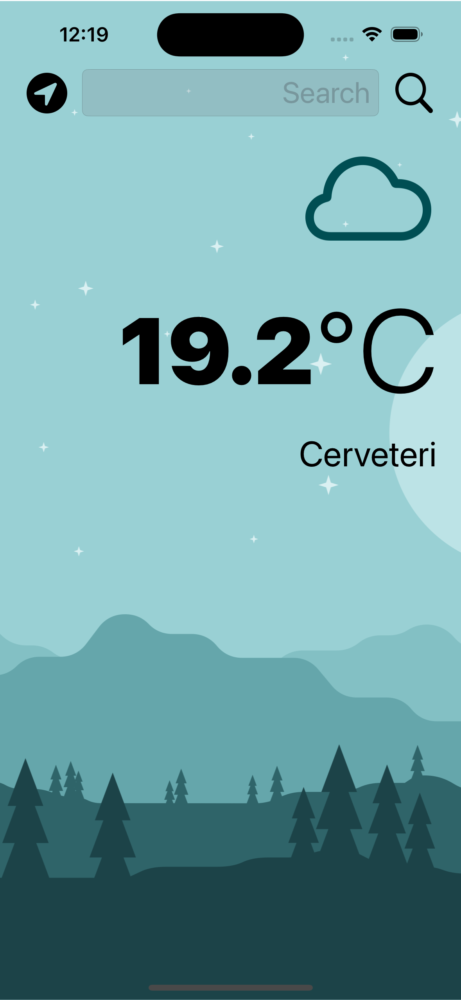
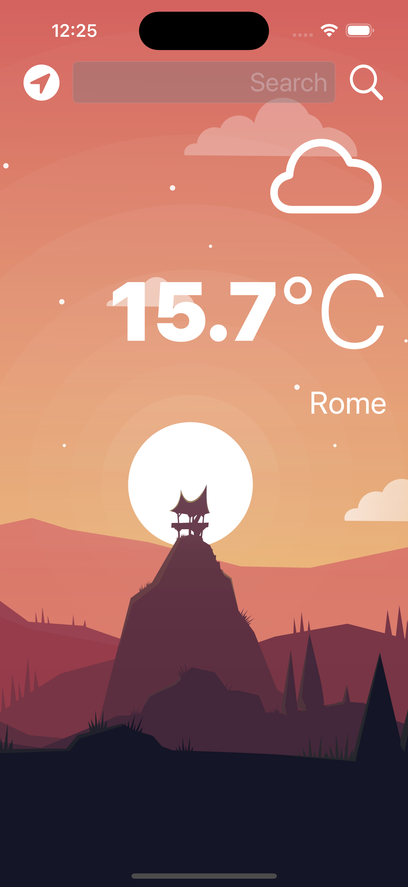

Clima

Modern iOS weather application built with SwiftUI featuring dynamic weather data, custom UI design, location-based weather and light/dark mode support.

Features
* Dynamic weather display
* Current location weather support
* City-based weather search
* Light and dark mode support
* Responsive SwiftUI interface
* Clean and modern mobile UI

Technologies Used
* Swift
* SwiftUI
* Core Location
* Weather API
* Xcode

App Preview
Short demo of the app interface and weather search functionality

https://github.com/user-attachments/assets/4321cb74-a0c1-4f86-864a-d48c9ae75a53

Screenshots
<### Light Mode

### Dark Mode

Future Improvements
* 5-day forecast
* Saved favourite cities
* Weather animations
* Additional weather detils (humidity, wind, visibility)
* Performance and UI refinements

Author
Christian Atzeni

GitHub: https://github.com/atzenichr

LinkedIn: https://linkedin.com/in/atzenichr
